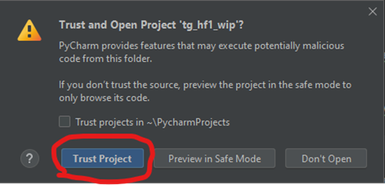
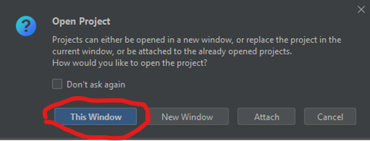
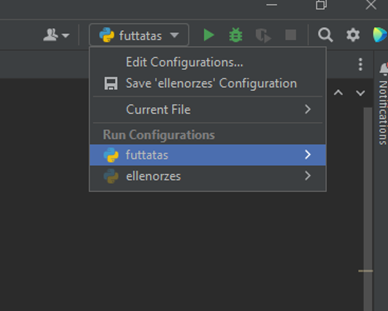

# Segédlet a program használatához
## Házi feladat megnyitása
A zip fájlban található egy mappa ‘tg_hfx_wip’ néven. Ezt kell megnyitni a Pycharm programmal a következő módon:

1.	Csomagold ki a mappát és helyezd el egy könnyen elérhető helyen (pl. asztal)

2.	Nyisd meg a Pycharm alkalmazást

3.	A bal felső sarokban a menüszalagon File -> Open és keresd meg a mappát a megjelenő ablakban, majd nyomd meg az ‘OK’ gombot.

4.	Ha megjelenik egy ablak, ami azt kérdezi bízol-e a mappában, válaszd a ‘Trust Project’ opciót.

5.	Ha megjelenik a következő ablak, válaszd a ‘This Window’ opciót.

 
6.	A projektet megnyitottuk.
 
## Ellenőrző funkció kipróbálása

A házi feladathoz készítettem egy automatikus ellenőrző szoftvert, ami a projektbe be van építve. A 0.-ik feladat ennek kipróbálására szolgál. A feladat abból áll, hogy ki kell írni a képernyőre, hogy “Szia”. Ezt megoldottam már én.

A programban a 6. sorban található egy `MELYIK_FELADATON_DOLGOZOK` változó, ennek az értéke jelenleg 0. Ezt minden feladatnál át kell állítani a feladat sorszámára, hogy a megfelelő feladathoz tartozó kódot tudd futtatni vagy ellenőrizni.

A 0. feladat ugyan megvan oldva, de próbáld ki az ellenőrző funkciót vele. Először futtasd le a programot teljesen szimplán, ahogy eddig is csináltuk. Ehhez a Pycharm-ban a job felső sarokban a következő legördülő menüben válaszd ki a “futtatas” opciót a futtatás ikon (zöld nyíl) mellett.

 
Ezt követően megnyomhatjuk a zöld nyilat, azaz futtathatjuk a programot. A kimenet a szokásos helyen látható. Ami fontos, hogy ezt követően csak a 0. feladat kimenete fog megjelenni (és csak ez fog lefutni), hiszen a `MELYIK_FELADATON_DOLGOZOK` értéke 0. 

 
Ebben eddig semmi meglepő nincs, azonban ha most ugyanebben a gördülő menüben átállítjuk a módot ’ellenorzes’-re, 

 
majd ismét megnyomjuk a zöld gombot, a program kiértékeli nekünk, hogy hogy oldottuk meg a feladatot.

 
Kipróbálhatjuk azt is, hogy mi történik akkor, ha hibás üzenetet írna ki a program. Ehhez a 18. sorban töröljük ki az idézőjelek közül a ‘!’ karaktert. Ha így nyomjuk meg a zöld gombot (ellenőrzés módban) a program a következőt írja ki:
 

Ha esetleg nem ezt látod a kimeneten, görgess feljebb a kimenet ablakán, vagy nagyítsd ki azt.
 
## A feladatok megoldása
Minden feladatot (az 1.-től kezdődően) a következő módon oldj meg:

1.	Állítsd át a módot a jobb felső sarokban ‘futtatas’-ra.

2.	Állítsd be a `MELYIK_FELADATON_DOLGOZOK` értéket a feladat sorszámára.

3.	Írd meg a kódot, közben nyugodtan futtathatsz a zöld nyíl segítségével. Csak annak a feladatnak a kódja fog lefutni, amin éppen dolgozol.

>FIGYELEM! Az egyes feladatok nem tudnak egymásról semmilyen formában, tehát ha mondjuk az 1-es feladatban bekértél egy számot és eltároltad, a második feladatban ezt nem tudod felhasználni, újra be kell kérni. Úgy tekints az egyes feladatokra, mintha teljesen külön fájlok lennének és mindegyiket 0-ról kell megírnod.

>FIGYELEM! A feladatok írása közben figyelj, hogy legalább egy tabulátornyi hely legyen minden sortól balra. Erre kommentek is figyelmeztetnek minden feladatnál.

4.	Ha szerinted jól működik a program és azt írja ki, ami szerinted jó megoldás, váltsd át a jobb felső sarokban a módot ’ellenorzes’-re.

5.	Ezután a zöld nyilat, ha megnyomod, ki fogja írni a program hogy jó-e a megoldásod. Ha nem jó, átírhatod és újra ellenőrizhetsz, vagy átválthatod megint a módot ‘futtatas’-ra, ha úgy kényelmesebb tesztelni.

6.	Ha jó a megoldásod, mehetsz tovább a következő feladatra, amit ugyanezekkel a lépésekkel kell megoldani.

